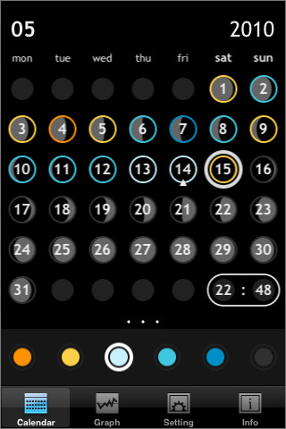
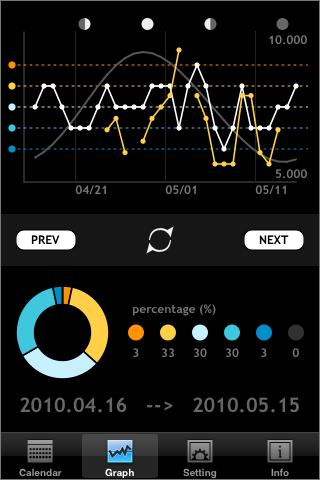

## Install

### Requirements

Node / NPM

Bower (Package Manager)

```
npm install bower -g
```

Inside your project run:

```
bower install x-tag-gallery
```

This downloads the component and dependencies to `./components`.


## Syntax

Gallery allows you to create slides of any content and then transition
between them. It supports x and y axis transitions.

```html
<x-gallery>
  <x-slides>
    <x-slide></x-slide>
    <x-slide></x-slide>
    <x-slide></x-slide>
    <x-slide></x-slide>
  </x-slides>
</x-gallery>
```


## Events
```slideend``` is fired at the end of each transition.

```javascript
document.querySelector('x-gallery').addEventListener('slideend', function(e) {

});
```


## Usage

```javascript
var gallery = document.querySelector('x-gallery');
gallery.slideNext();
gallery.slidePrevious();
gallery.slideTo(1);  // index of desired x-slide

gallery.orientation = 'y';  // slide vertically
```
